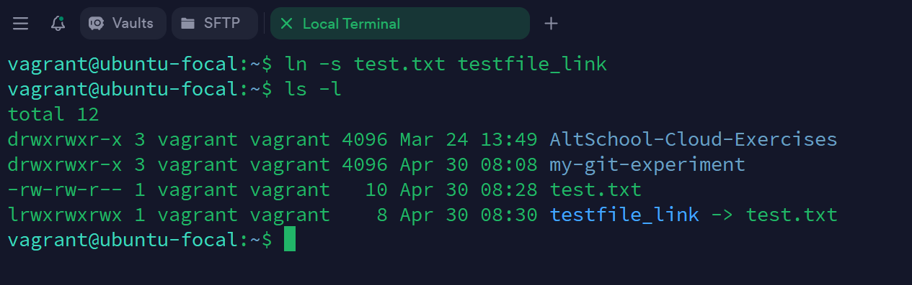

 # 10 Linux commands
   This document explains 10 additional Linux commands with examples and screenshots.


 ## 1. `ln` - Creates a symbolic link (shortcut) to another file. 

 ### syntax:

	```bash 
	
	ln -s [target_file] [link_name]
 
 ### example:
	
	

 
 ## 2. `less` - Helps to easily move down a large file using the enter key.

 ### syntax:

        ```bash

        less [file_name]


 ## 3. `tar` - Create/compress and extract archived files. '-cvf' compresses and '-xvf' extracts the files.

 ### syntax:

        ```bash

        tar -cvf [achive-file.tar] [file_names seperated by space]
	
	tar -xvf [achive-file.tar]


 ## 4. `diff` - Finds the difference between two files.

 ### syntax:

        ```bash

        diff [file_1] [file_2]


 ## 5. `cmp` - Allows you to check if two files are identical, it displays the first difference and the line number.

 ### syntax:

        ```bash

        cmp [file_1] [file_2] 


 ## 6. `sort` - Sorts the content of a file while outputting.

 ### syntax:

        ```bash

        sort [file_name]


 ## 7. `zip` - Zip files in Linux.

 ### syntax:

        ```bash

        zip [file_name.zip] [file_names seperated by space]


 ## 8. `unzip` - UnZip files in Linux.

 ### syntax:

        ```bash

        unzip [file_name.zip]


 ## 9. `cal` - Helps view calender in command line.

 ### syntax:

        ```bash

        cal


 ## 10. `alias` - Creates custom shortcuts for your regularly used commands.

 ### syntax:

        ```bash

        alias replacement_command="original_command"
